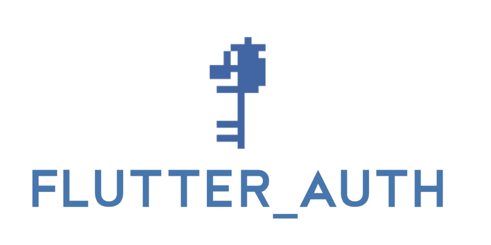

<p align="center">
  <a href="https://stacktiger.io/flutter_auth">
    <br/>
  </a>
</p>

<p align="center">
  <a href="https://github.com/StackTiger/flutter_auth/actions?query=workflow%3Aall_plugins">
    
  </a>
  <a href="https://github.com/invertase/melos">
    
  </a>
 </p>

---
## About

flutter_auth is a family of flutter plugins that provides an interface to sign-in with social auth providers such as Twitter & GitHub. View the [documentation](https://stacktiger.github.io/flutter_auth) for a full overview and usage.

## How
Every plugin extends [flutter_auth_core](https://github.com/stacktiger/flutter_auth/tree/main/packages/flutter_auth_core) to provide a unified API making social auth integration easy. 

```dart
Future<void> signIn(BuildContext context) async {
    // 1. get an auth instance for your chosen social auth provider
    // For example, Twitter
    final auth = TwitterAuth(
      clientId: 'your-client-id',
      clientSecret: 'your-client-secret',
      callbackUrl: 'your-callback-url',
    );

    // 2. call login() with your app's BuildContext as the required argument
    try {
      FlutterAuthResult resp = await auth.login(context);
      print('Successfully signed in with result $resp');
    } on FlutterAuthException catch (e) {
      switch (e.code) {
        case FlutterAuthExceptionCode.cancelled:
          print('Sign-in process was cancelled by user: ${e.toString()}');
          break;
        case FlutterAuthExceptionCode.network:
          print('A network exception was thrown: ${e.toString()}');
          break;
        case FlutterAuthExceptionCode.login:
          print(
              'A exception occurred during an sign-in attempt: ${e.toString()}');
          break;
      }
    } catch (e) {
      print('A unexpected exception occurred during an sign-in attempt $e');
    }
   }
```


## Plugins

**Table of contents:**

 - [Twitter (`twitter_auth`)](#twitter_auth)
 - [GitHub (`github_auth`)](#github_auth)
---

### `twitter_auth`

Twitter Auth provides an interface to Twitter's OAuth Log In flow to authenticate a user. 

[[View Source][twitter_code]]

#### Platform Support

| Android |  iOS  | MacOS |  Web  |
| :-----: | :---: | :---: | :---: |
|    ✔️    |   ✔️   |   x   |   x   |

### `github_auth`

GitHub Auth provides an interface to GitHub's OAuth Log in flow to authenticate a user. 

[[View Source][github_code]]

#### Platform Support

| Android |  iOS  | MacOS |  Web  |
| :-----: | :---: | :---: | :---: |
|    ✔️    |   ✔️   |   x   |   x   |

----

## Issues

Please file flutter_auth specific issues, bugs, or feature requests in our [issue tracker](https://github.com/stacktiger/flutter_auth/issues/new).

Plugin issues that are not specific to flutter_auth can be filed in the [Flutter issue tracker](https://github.com/flutter/flutter/issues/new).

## Contributing

If you wish to contribute a change to any of the existing plugins in this repo,
please review our [contribution guide](https://github.com/StackTiger/flutter_auth/blob/master/CONTRIBUTING.md)
and open a [pull request](https://github.com/StackTiger/flutter_auth/pulls).

## Maintainers

This repository is maintained by [StackTiger](https://stacktiger.co/) 🐯 

[twitter_pub]: https://pub.dev/packages/twitter_auth
[twitter_code]: https://github.com/StackTiger/flutter_auth/tree/master/packages/twitter_auth
[twitter_pub_points]: https://pub.dev/packages/twitter_auth/score
[twitter_badge_pub_points]: https://badges.bar/twitter_auth/pub%20points
[twitter_badge_pub]: https://img.shields.io/pub/v/twitter_auth.svg

[github_pub]: https://pub.dev/packages/github_auth
[github_code]: https://github.com/StackTiger/flutter_auth/tree/master/packages/github_auth
[github_pub_points]: https://pub.dev/packages/github_auth/score
[github_badge_pub_points]: https://badges.bar/github_auth/pub%20points
[github_badge_pub]: https://img.shields.io/pub/v/github_auth.svg
